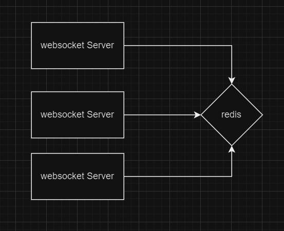

# Jwt 로 보안을 강화한 websocket chat 프로그램
> 웹소켓 인터페이스 stomp과 redis pub/sub 을 활용한 채팅 프로그램

## SPEC
* java 17
* spring 3.1 
* Stomp
* jpa
* redis pub/sub

### Stomp
* 웹소켓 위에서 동작하는 프로토콜 pub/sub 기반으로 만들어짐
* 메시지 브로커를 사용해 메시지 관리 가능
* @Controller 로 로직 관리 가능

### redis pub/sub
* 레디스를 사용
* 메시지 생산자, 소비자 객체를 분리해 제공하는 비동기식 메시징 방법
* 느슨한 결합, 비동기 통신, 메시지 버퍼링

## 구조

* 클라이언트와 웹소켓간 연결
* 메세지가 pub 되면 레디스 pub 에서 받음
* sub 하고 있는 웹소켓 채널에서 해당 메세지를 받아 클라언트에 전송